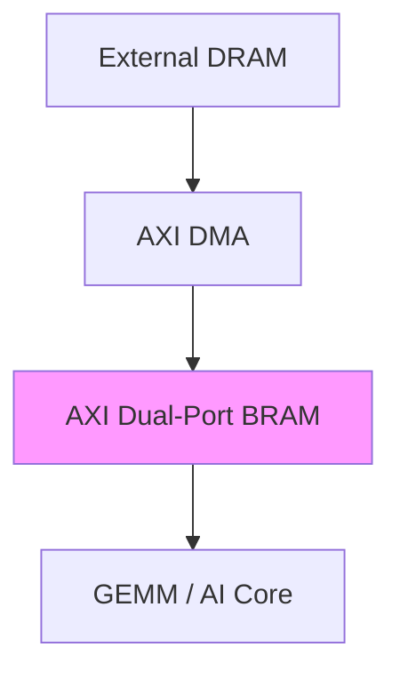

# AXI Dual-Port Multi-Clock BRAM 

## 1. Overview

This module is a **verification-oriented**, **multi-clock**, **dual-port** **AXI4 Memory-Mapped scratchpad model**.

I mainly use it for:
- Architecture exploration (DMA + accelerator style subsystems)
- Subsystem-level integration testing
- AXI protocol / ordering / backpressure verification
- Multi-clock interaction testing

> Disclaimer:  
>
> This is **not** a vendor BRAM macro model and is **not meant to infer FPGA true dual-port BRAM**.  
>
> The goal here is to make the behavior easier to verify and debug, with deterministic commit semantics and good observability.

## 2. Model behavior

Instead of acting like a cycle-exact RAM macro, this model behaves more like:
- A shared scratchpad accessed by **two independent AXI-MM slave ports**
- Writes that become visible at a clear **burst commit boundary**
- A conservative **READ_FIRST / no-forwarding** read behavior
- Realistic backpressure through AXI ready/valid handshakes

## 3. Key characteristics

### 3.1 Dual AXI4-MM slave interfaces (two ports, two clocks)

| Port | Clock Domain | Intended Use |
|---|---|---|
| Port0 (`axi0_if`) | `dma_clk` | DMA / Host side |
| Port1 (`axi1_if`) | `core_clk` | Core side |

Each port supports:
- AW / W / B / AR / R channels
- Burst types: **INCR / WRAP / FIXED**  
  - FIXED is modeled as **constant-address access**
- `WSTRB` byte enables
- Backpressure through `*_ready`

Scope notes:
- Responses are **OKAY only** (`BRESP/RRESP = 2'b00`)
- Write data is assumed **in-order** with respect to the active AW (no W reordering across different AWs)

### 3.2 Burst-level atomic commit

Write beats are **buffered per burst**.

That means:
- The memory array `mem_word[]` is **not updated beat-by-beat**
- A single **commit engine** in the `dma_clk` domain commits **one burst at a time**
- The memory image changes **atomically at burst commit boundary**

Write response timing is tied to commit completion:
- **Port0:** `B` is generated only after commit finishes
- **Port1:** the **last-beat ACK** back to `core_clk` is deferred until commit finishes, and core-side `B` is generated after that

### 3.3 Apply and commit observability

After a burst is applied/committed, the DUT exposes it through two observation interfaces:

- `axi_mm_apply_if`
- `axi_mm_commit_if`

Both are handshaked and live in the `dma_clk` domain.

These are mainly for:
- Scoreboard alignment
- Debugging tricky cross-clock cases
- Making burst visibility easier to reason about in verification

### 3.4 READ_FIRST behavior

Reads are intentionally conservative:
- Reads only observe **committed** `mem_word[]` state
- No read forwarding / bypass between ports
- Read path models **2-cycle latency**
- Each port also has its own read FIFO, so the R channel can still stall through `rready`

## 4. Internal memory model

- Behavioral storage:

​	`logic [DATA_WIDTH-1:0] mem_word [0:DEPTH_WORDS-1];`

- Addressing:
  - AXI addresses are treated as byte addresses

- Internally, accesses are mapped to words as:

​	`word_index = (byte_addr >> log2(DATA_WIDTH/8)) % DEPTH_WORDS`

- Byte lane mapping:

​	`lane 0 = WDATA[7:0]` (lowest byte address in the word)

- WSTRB[0] controls lane 0, and so on

  

## 5. Main parameters

| Parameter                          | Meaning                                    |
| ---------------------------------- | ------------------------------------------ |
| DATA_WIDTH, ADDR_WIDTH, ID_WIDTH   | AXI widths                                 |
| DEPTH_WORDS                        | Memory depth in words                      |
| MAX_BURST_BEATS                    | Maximum buffered beats per burst           |
| RD_FIFO_DEPTH                      | Per-port read FIFO depth                   |
| WR_AW_DEPTH, WR_B_DEPTH            | Outstanding buffering for AW/B             |
| P0_WEIGHT                          | Weighted arbitration bias in commit engine |
| STARVE_THRESHOLD, ASSERT_ON_STARVE | Starvation detection / warning             |
| LOG_ENABLE, LOG_INTERVAL_CYCLES    | Sim-only performance logging               |

## 6. Arbitration / fairness model

When both ports already have a fully buffered burst ready to commit:

- The commit engine selects one burst using a **weighted policy**

  - Port0 can be biased through P0_WEIGHT

  - Port1 starvation is monitored

A simulation warning can be generated if Port1 is not served for too long

## 7. Verification status

This model has been verified in UVM 1.2 environment with:

- Smoke test

- Directed test

- Random test

- Corner test

- Coverage test

Current status:

- The latest runs completed with:

  - Smoke test: PASS

  - Directed test: PASS

  - Random test: PASS

  - Corner test: PASS

  - Coverage test: PASS

Scoreboard final results are now clean with no mismatches in the completed regression runs above.

Coverage progress:

- After reworking that part and aligning the scoreboard with the DUT's apply/commit visibility behavior, the total covergroup coverage has the following result:
  - **From 70.53% improved to 96.14% total covergroup coverage**

This was a pretty significant improvement and helped close the remaining mismatch issue that only showed up in the more stressful coverage runs.

## 8. Scoreboard / stability note

Because this is a multi-clock behavioral model (`dma_clk` commit engine + `core_clk` read side), the verification environment uses a stability window to avoid false mismatches caused by cross-domain timing.

Scoreboard setting:

- `COMMIT_STABLE_DELAY` = 30ns

  - Meaning that after a burst is considered visible/committed in the testbench model, the scoreboard waits 30nsbefore treating that memory state as stable for cross-domain comparison

  - It was added to keep regressions deterministic and to avoid false failures in aggressive cross-clock stress cases.

    

## 9. Limitations / non-goals

Current non-goals:

- Not intended to infer true dual-port BRAM macros

- Does not model vendor-specific RAM collision modes

- Does not model a real hardware CDC RAM structure

- OKAY-only responses

- Focus is verification/debug friendliness, not exact RAM macro behavior

  

## 10. Read burst admission note

Read requests are admitted based on internal FIFO capacity.

A read burst is only accepted if:

- `(ARLEN + 1) <= RD_FIFO_DEPTH`
  - This is intentional as the model does not accept a read burst that it cannot buffer completely

In practice:

- If a master issues bursts longer than `RD_FIFO_DEPTH`, `ARREADY` may stay low

- The read can stall until the burst size is acceptable

Typical expectation:

- Use chunked reads, which is common for DMA / tiled accelerator access

- Or increase `RD_FIFO_DEPTH` if longer bursts are needed

  

## 11. Typical subsystem usage

Conceptually, this model sits between a DMA side and a Core side:

Typical usage:

- Weight / activation scratchpad

- DMA ↔ Core clock decoupling layer

- Deterministic shared memory boundary for subsystem testing